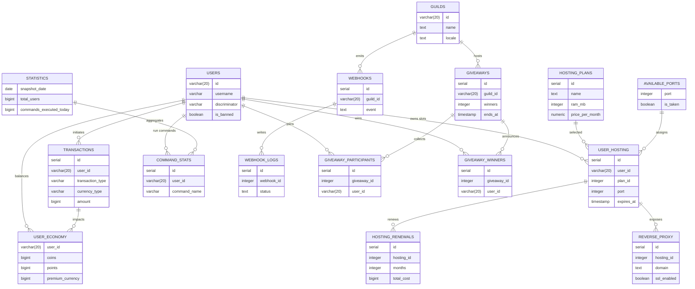
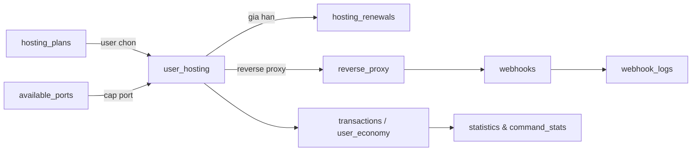

# 📚 WhiteCat Database Guide

Hướng dẫn chi tiết về cơ sở dữ liệu của WhiteCat Bot.

## 📋 Mục Lục
- [Khởi Tạo Database](#-khởi-tạo-database)
- [Cấu Trúc Database](#-cấu-trúc-database)
- [Quan Hệ Giữa Các Bảng](#-quan-hệ-giữa-các-bảng)
- [Best Practices](#-best-practices)
- [Ví Dụ Queries](#-ví-dụ-queries)

## Visual Database Playground

Muon nhin thay so do database thay vi chi doc bang mo ta? Thu mot trong cac cach duoi day:

1. **Preview Mermaid ngay trong VS Code hoac GitHub**
   - Mo file DATABASE_GUIDE.md va nhan Ctrl+Shift+V (Markdown: Open Preview to the Side).
   - Mermaid ERD o phan duoi se render ngay; di chuot qua bang de highlight quan he.
   - Cach nay hop de review nhanh hoac pair vơi teammate.
2. **Dan block DBML ben duoi vao dbdiagram.io hoac Diagram.codes**
   - Mo https://dbdiagram.io/new (hoac https://diagram.codes/db) > paste DBML > Ctrl+Enter.
   - Chon Engine: PostgreSQL de tu dong format field type.
   - Co the xuat PNG/SVG hoac share link visual cho team product/QA.

Ngoai ra co the dung cac UI client pho bien nhu Beekeeper Studio, TablePlus, pgAdmin (ket noi bang connection string postgres://DB_USER:DB_PASSWORD@DB_HOST:DB_PORT/DB_NAME lay tu file .env) neu can thao tac truc tiep.

### Mermaid ER Overview (render truc tiep trong Markdown)



### Hosting & monetization flow



### DBML snippet (copy/paste sang dbdiagram)

```dbml
Table users {
  id varchar(20) [pk]
  username varchar(32)
  discriminator varchar(4)
  email varchar(255)
  locale varchar(10)
  is_banned boolean
}

Table user_economy {
  user_id varchar(20) [pk, ref: > users.id]
  coins bigint
  points bigint
  premium_currency bigint
}

Table transactions {
  id serial [pk]
  user_id varchar(20) [ref: > users.id]
  transaction_type varchar(20)
  currency_type varchar(20)
  amount bigint
  target_user_id varchar(20) [ref: > users.id]
}

Table hosting_plans {
  id serial [pk]
  name text
  ram_mb int
  cpu_cores int
  price_per_month numeric
}

Table user_hosting {
  id serial [pk]
  user_id varchar(20) [ref: > users.id]
  plan_id int [ref: > hosting_plans.id]
  port int [ref: > available_ports.port]
  expires_at timestamp
}

Table hosting_renewals {
  id serial [pk]
  hosting_id int [ref: > user_hosting.id]
  months int
  total_cost bigint
}

Table available_ports {
  port int [pk]
  is_taken boolean
}

Table reverse_proxy {
  id serial [pk]
  hosting_id int [ref: > user_hosting.id]
  domain text
  ssl_enabled boolean
}

Table guilds {
  id varchar(20) [pk]
  name text
  locale text
}

Table webhooks {
  id serial [pk]
  guild_id varchar(20) [ref: > guilds.id]
  event text
}

Table webhook_logs {
  id serial [pk]
  webhook_id int [ref: > webhooks.id]
  status text
}

Table giveaways {
  id serial [pk]
  guild_id varchar(20) [ref: > guilds.id]
  winners int
  ends_at timestamp
}

Table giveaway_participants {
  id serial [pk]
  giveaway_id int [ref: > giveaways.id]
  user_id varchar(20) [ref: > users.id]
}

Table giveaway_winners {
  id serial [pk]
  giveaway_id int [ref: > giveaways.id]
  user_id varchar(20) [ref: > users.id]
}
```

> Tip: Sau khi render diagram co the export anh, chen vao docs khac hoac gui link cho thanh vien khong doc code.


---

## 🚀 Khởi Tạo Database

### Yêu Cầu
- PostgreSQL 12+ đã được cài đặt
- File `.env` đã được cấu hình đúng

### Cấu Hình `.env`

```env
# PostgreSQL Database Configuration
DB_HOST=localhost
DB_PORT=5432
DB_NAME=discord_bot
DB_USER=postgres
DB_PASSWORD=your_password_here

# Database Pool Configuration (optional)
DB_POOL_MIN=2
DB_POOL_MAX=10
```

### Các Lệnh Database

```bash
# Tạo tất cả bảng (lần đầu tiên hoặc khi thêm bảng mới)
npm run db:init

# Xóa tất cả bảng (⚠️ CẢNH BÁO: Mất hết dữ liệu!)
npm run db:drop

# Reset database (xóa và tạo lại từ đầu)
npm run db:reset
```

### Quy Trình Setup Lần Đầu

1. **Tạo database trong PostgreSQL:**
   ```sql
   CREATE DATABASE discord_bot;
   ```

2. **Cấu hình file `.env`** với thông tin database

3. **Chạy lệnh init:**
   ```bash
   npm run db:init
   ```

4. **Verify:** Kiểm tra xem các bảng đã được tạo chưa
   ```sql
   \dt  -- Trong PostgreSQL terminal
   ```

---

## 🗂️ Cấu Trúc Database

### 👤 User & Authentication

#### `users`
Lưu trữ thông tin người dùng Discord và OAuth.

| Column | Type | Description |
|--------|------|-------------|
| `id` | VARCHAR(20) PK | Discord user ID |
| `username` | VARCHAR(32) | Discord username |
| `discriminator` | VARCHAR(4) | Discord discriminator (#1234) |
| `email` | VARCHAR(255) | Email (cần OAuth advanced) |
| `avatar` | VARCHAR(255) | Avatar hash |
| `access_token` | TEXT | OAuth access token |
| `refresh_token` | TEXT | OAuth refresh token |
| `oauth_level` | VARCHAR(20) | none/basic/advanced |
| `locale` | VARCHAR(10) | Ngôn ngữ user chọn (en, vi) |
| `is_banned` | BOOLEAN | User có bị ban không |
| `ban_reason` | TEXT | Lý do ban |
| `banned_at` | TIMESTAMP | Thời gian bị ban |
| `ban_expires_at` | TIMESTAMP | Thời gian hết ban (NULL = permanent) |

**Indexes:**
- `username`, `email`, `is_banned`, `oauth_level`

---

### 💰 Economy System

#### `user_economy`
Quản lý tiền tệ và streak của user.

| Column | Type | Description |
|--------|------|-------------|
| `user_id` | VARCHAR(20) FK | Reference đến `users.id` |
| `coins` | BIGINT | Tiền thường (>= 0) |
| `points` | BIGINT | Điểm (>= 0) |
| `premium_currency` | BIGINT | Tiền premium (>= 0) |
| `daily_streak` | INTEGER | Số ngày streak daily |
| `last_daily_claim` | TIMESTAMP | Lần claim daily cuối |
| `weekly_streak` | INTEGER | Số tuần streak weekly |
| `last_weekly_claim` | TIMESTAMP | Lần claim weekly cuối |

**Đặc điểm:**
- Tự động CASCADE delete khi user bị xóa
- CHECK constraints đảm bảo số tiền không âm
- Auto-update `updated_at` trigger

#### `transactions`
Lịch sử giao dịch chi tiết.

| Column | Type | Description |
|--------|------|-------------|
| `id` | SERIAL PK | Transaction ID |
| `user_id` | VARCHAR(20) FK | User thực hiện giao dịch |
| `transaction_type` | VARCHAR(20) | earn/spend/transfer/purchase/admin_give/admin_take |
| `currency_type` | VARCHAR(20) | coins/points/premium |
| `amount` | BIGINT | Số tiền |
| `target_user_id` | VARCHAR(20) FK | User nhận (nếu transfer) |
| `description` | TEXT | Mô tả giao dịch |
| `metadata` | JSONB | Dữ liệu thêm (item ID, etc.) |

**Indexes:**
- `user_id`, `transaction_type`, `created_at DESC`, `target_user_id`

**Ví dụ metadata:**
```json
{
  "item_id": "hosting_plan_1",
  "item_name": "Basic Hosting",
  "quantity": 1,
  "note": "Monthly subscription"
}
```

---

### 🖥️ Hosting System

#### `hosting_plans`
Các gói hosting có sẵn.

| Column | Type | Description |
|--------|------|-------------|
| `id` | SERIAL PK | Plan ID |
| `name` | VARCHAR(100) UNIQUE | Tên gói (VD: "Basic", "Pro") |
| `description` | TEXT | Mô tả gói |
| `ram_mb` | INTEGER | RAM (MB) |
| `cpu_cores` | DECIMAL(3,2) | CPU cores (VD: 1.50) |
| `storage_gb` | INTEGER | Dung lượng (GB) |
| `price_coins` | BIGINT | Giá bằng coins |
| `price_premium` | BIGINT | Giá bằng premium currency |
| `duration_days` | INTEGER | Thời hạn (ngày) |
| `is_active` | BOOLEAN | Còn bán không |

#### `user_hosting`
Hosting mà user đã mua.

| Column | Type | Description |
|--------|------|-------------|
| `id` | SERIAL PK | Instance ID |
| `user_id` | VARCHAR(20) FK | User sở hữu |
| `plan_id` | INTEGER FK | Gói hosting |
| `instance_name` | VARCHAR(100) | Tên instance |
| `port` | INTEGER UNIQUE | Port được cấp |
| `contact_email` | VARCHAR(255) | Email liên hệ (required) |
| `status` | VARCHAR(20) | active/expired/suspended/cancelled |
| `auto_renew` | BOOLEAN | Tự động gia hạn |
| `purchased_at` | TIMESTAMP | Ngày mua |
| `expires_at` | TIMESTAMP | Ngày hết hạn |

**Lưu ý:**
- User PHẢI có `oauth_level = 'advanced'` (có email) mới mua được hosting
- Port là UNIQUE, không thể trùng
- Status tự động update khi expires_at < NOW()

#### `hosting_renewals`
Lịch sử gia hạn hosting.

#### `available_ports`
Quản lý ports có sẵn và đã sử dụng.

---

### 🌐 Reverse Proxy

#### `reverse_proxy`
Mapping domain → port.

| Column | Type | Description |
|--------|------|-------------|
| `id` | SERIAL PK | Proxy ID |
| `hosting_id` | INTEGER FK | Instance hosting |
| `domain` | VARCHAR(255) UNIQUE | Domain/subdomain |
| `target_port` | INTEGER | Port đích |
| `ssl_enabled` | BOOLEAN | SSL có bật không |
| `ssl_expires_at` | TIMESTAMP | Ngày hết hạn SSL |

---

### 🎮 Discord Guilds

#### `guilds`
Thông tin server Discord và settings.

| Column | Type | Description |
|--------|------|-------------|
| `id` | VARCHAR(20) PK | Discord guild ID |
| `name` | VARCHAR(100) | Tên server |
| `locale` | VARCHAR(10) | Ngôn ngữ mặc định |
| `prefix` | VARCHAR(10) | Bot prefix (mặc định: !) |
| `settings` | JSONB | Settings tùy chỉnh |
| `features_enabled` | TEXT[] | Array features đã bật |
| `is_active` | BOOLEAN | Bot còn trong server không |

**Ví dụ settings:**
```json
{
  "welcome_channel": "123456789",
  "log_channel": "987654321",
  "auto_role": "111222333",
  "moderation": {
    "anti_spam": true,
    "auto_mod": false
  }
}
```

---

### 🔗 Webhooks

#### `webhooks`
Webhooks do user tạo.

| Column | Type | Description |
|--------|------|-------------|
| `id` | SERIAL PK | Webhook ID |
| `user_id` | VARCHAR(20) FK | User sở hữu |
| `name` | VARCHAR(100) | Tên webhook |
| `url` | TEXT | Webhook URL |
| `secret` | VARCHAR(255) | Secret để verify |
| `events` | TEXT[] | Events lắng nghe |
| `is_active` | BOOLEAN | Active không |

#### `webhook_logs`
Logs để debug webhooks.

---

### 📊 Statistics

#### `statistics`
Thống kê theo ngày (daily snapshots).

| Column | Type | Description |
|--------|------|-------------|
| `snapshot_date` | DATE UNIQUE | Ngày snapshot |
| `total_users` | BIGINT | Tổng users |
| `active_users_today` | BIGINT | Users hoạt động hôm nay |
| `commands_executed_today` | BIGINT | Lệnh được chạy |
| `revenue_coins_today` | BIGINT | Doanh thu coins |

#### `command_stats`
Thống kê chi tiết từng lệnh.

---

### 🎁 Giveaway System

#### `giveaways`
Các giveaway đang chạy/đã kết thúc.

| Column | Type | Description |
|--------|------|-------------|
| `id` | SERIAL PK | Giveaway ID |
| `guild_id` | VARCHAR(20) | Server Discord |
| `prize` | TEXT | Phần thưởng |
| `winners_count` | INTEGER | Số winners |
| `required_role_id` | VARCHAR(20) | Role yêu cầu (nullable) |
| `min_coins` | BIGINT | Số coins tối thiểu để join |
| `status` | VARCHAR(20) | active/ended/cancelled |
| `ends_at` | TIMESTAMP | Thời gian kết thúc |

#### `giveaway_participants`
Danh sách người tham gia.

#### `giveaway_winners`
Winners đã được chọn.

---

## 🔗 Quan Hệ Giữa Các Bảng

```
users (1) ──┬── (1) user_economy
            │
            ├── (*) transactions
            │
            ├── (*) user_hosting ──┬── (1) hosting_plans
            │                      │
            │                      └── (*) reverse_proxy
            │
            ├── (*) webhooks ───── (*) webhook_logs
            │
            ├── (*) giveaways ──┬── (*) giveaway_participants
            │                   │
            │                   └── (*) giveaway_winners
            │
            └── (*) command_stats

guilds (*) ── (independent)
```

### Foreign Key Rules

- `ON DELETE CASCADE`: Khi xóa user, tự động xóa tất cả data liên quan
- `ON DELETE SET NULL`: Khi xóa user, set NULL (giữ lại history)

---

## ✨ Best Practices

### 1. **Luôn sử dụng Transactions cho Operations phức tạp**

```typescript
import { pool } from './database/config';

async function purchaseHosting(userId: string, planId: number) {
  const client = await pool.connect();

  try {
    await client.query('BEGIN');

    // 1. Trừ tiền user
    await client.query(
      'UPDATE user_economy SET coins = coins - $1 WHERE user_id = $2',
      [price, userId]
    );

    // 2. Tạo hosting instance
    const result = await client.query(
      'INSERT INTO user_hosting (user_id, plan_id, ...) VALUES ($1, $2, ...) RETURNING *',
      [userId, planId, ...]
    );

    // 3. Log transaction
    await client.query(
      'INSERT INTO transactions (user_id, transaction_type, ...) VALUES ($1, $2, ...)',
      [userId, 'purchase', ...]
    );

    await client.query('COMMIT');
    return result.rows[0];

  } catch (error) {
    await client.query('ROLLBACK');
    throw error;
  } finally {
    client.release();
  }
}
```

### 2. **Sử dụng Indexes hiệu quả**

Các indexes đã được tạo sẵn cho:
- Foreign keys (tự động tăng performance cho JOINs)
- Columns thường xuyên WHERE/ORDER BY
- UNIQUE constraints

### 3. **Validate trước khi Insert**

```typescript
// Check user có đủ tiền không
const { coins } = await pool.query(
  'SELECT coins FROM user_economy WHERE user_id = $1',
  [userId]
);

if (coins < price) {
  throw new Error('Insufficient coins');
}

// Check user có OAuth advanced không (để mua hosting)
const { oauth_level } = await pool.query(
  'SELECT oauth_level FROM users WHERE id = $1',
  [userId]
);

if (oauth_level !== 'advanced') {
  throw new Error('Advanced OAuth required to purchase hosting');
}
```

### 4. **Sử dụng JSONB cho flexible data**

```typescript
// Lưu metadata trong transactions
await pool.query(
  `INSERT INTO transactions (user_id, metadata) VALUES ($1, $2)`,
  [userId, JSON.stringify({
    item_type: 'hosting',
    plan_name: 'Pro Hosting',
    duration_days: 30
  })]
);

// Query JSONB
const results = await pool.query(
  `SELECT * FROM transactions
   WHERE metadata->>'item_type' = 'hosting'`
);
```

### 5. **Auto-update timestamps**

Trigger đã được tạo sẵn cho `updated_at`. Mỗi khi UPDATE, `updated_at` tự động cập nhật.

---

## 📝 Ví Dụ Queries

### Kiểm tra user có bị ban không

```sql
SELECT is_banned, ban_reason, ban_expires_at
FROM users
WHERE id = '123456789'
  AND (is_banned = FALSE OR ban_expires_at < NOW());
```

### Lấy top 10 users giàu nhất

```sql
SELECT u.username, e.coins, e.points
FROM users u
JOIN user_economy e ON u.id = e.user_id
ORDER BY e.coins DESC
LIMIT 10;
```

### Lấy hosting instances sắp hết hạn (trong 7 ngày)

```sql
SELECT
  uh.id,
  uh.instance_name,
  u.username,
  uh.expires_at,
  uh.auto_renew
FROM user_hosting uh
JOIN users u ON uh.user_id = u.id
WHERE uh.status = 'active'
  AND uh.expires_at BETWEEN NOW() AND NOW() + INTERVAL '7 days'
ORDER BY uh.expires_at ASC;
```

### Thống kê giveaway

```sql
SELECT
  g.id,
  g.prize,
  g.status,
  COUNT(DISTINCT gp.user_id) as total_participants,
  COUNT(DISTINCT gw.user_id) as total_winners
FROM giveaways g
LEFT JOIN giveaway_participants gp ON g.id = gp.giveaway_id
LEFT JOIN giveaway_winners gw ON g.id = gw.giveaway_id
WHERE g.guild_id = '123456789'
GROUP BY g.id;
```

### Tính tổng revenue theo ngày

```sql
SELECT
  DATE(created_at) as date,
  SUM(CASE WHEN currency_type = 'coins' THEN amount ELSE 0 END) as coins_revenue,
  SUM(CASE WHEN currency_type = 'premium' THEN amount ELSE 0 END) as premium_revenue
FROM transactions
WHERE transaction_type = 'purchase'
  AND created_at >= NOW() - INTERVAL '30 days'
GROUP BY DATE(created_at)
ORDER BY date DESC;
```

### Tìm users không hoạt động lâu

```sql
SELECT
  id,
  username,
  last_login_at,
  NOW() - last_login_at as inactive_duration
FROM users
WHERE last_login_at < NOW() - INTERVAL '90 days'
ORDER BY last_login_at ASC;
```

---

## 🛠️ Maintenance Tasks

### Cleanup old webhook logs (chạy định kỳ)

```sql
DELETE FROM webhook_logs
WHERE created_at < NOW() - INTERVAL '30 days';
```

### Archive old command stats

```sql
-- Tạo bảng archive
CREATE TABLE command_stats_archive (LIKE command_stats);

-- Move old data
INSERT INTO command_stats_archive
SELECT * FROM command_stats
WHERE executed_at < NOW() - INTERVAL '90 days';

-- Delete from main table
DELETE FROM command_stats
WHERE executed_at < NOW() - INTERVAL '90 days';
```

### Update daily statistics (chạy mỗi ngày)

```sql
INSERT INTO statistics (
  snapshot_date,
  total_users,
  active_guilds_today,
  commands_executed_today
) VALUES (
  CURRENT_DATE,
  (SELECT COUNT(*) FROM users),
  (SELECT COUNT(*) FROM guilds WHERE is_active = true),
  (SELECT COUNT(*) FROM command_stats WHERE executed_at::date = CURRENT_DATE)
)
ON CONFLICT (snapshot_date) DO UPDATE
SET total_users = EXCLUDED.total_users,
    active_guilds_today = EXCLUDED.active_guilds_today,
    commands_executed_today = EXCLUDED.commands_executed_today;
```

---

## 🔒 Security Notes

1. **NEVER** commit file `.env` vào git
2. Sử dụng parameterized queries (đã có sẵn trong `pg` library) để tránh SQL injection
3. Encrypt sensitive data như `access_token`, `refresh_token` trong production
4. Regularly backup database
5. Set up proper user permissions trong PostgreSQL (đừng dùng superuser)

---

## 📚 Tài Liệu Tham Khảo

- [PostgreSQL Official Docs](https://www.postgresql.org/docs/)
- [node-postgres (pg) Documentation](https://node-postgres.com/)
- [Discord.js Guide](https://discordjs.guide/)

---

## ❓ Troubleshooting

### "relation does not exist" error
→ Chạy `npm run db:init` để tạo bảng

### "connection refused" error
→ Kiểm tra PostgreSQL có đang chạy không

### "authentication failed" error
→ Kiểm tra lại `DB_USER` và `DB_PASSWORD` trong `.env`

### "duplicate key violation" error
→ Đang cố insert data trùng UNIQUE constraint (VD: port đã được dùng)

---

Made with ❤️ by GauCandy
